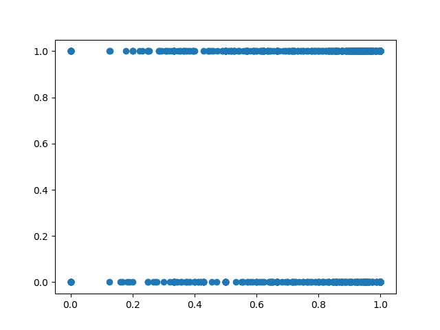

# CS 565 User Modeling Introductory Project
###### Sirut Buasai, sbuasai2@wpi.edu

## Getting Started
- This markdown file is the main document for the project write-up.

- All the tasks given in the [introductory-project](https://sites.google.com/view/cs565-user-modeling/introductory-project?authuser=0) will be answered here.

- To view the work, please take a look at `main.py` file that is given along with this file.

- Most comments in `main.py` file are identical to most of the answers that will be written here in this write up.

- In this project, I decided to use `PSA59VC` adaptive vs non-adaptive experiment dataset. Before running the `main.py` script, please ensure you have the data within the directory.

- I greatly recommend viewing this file with some type of markdown viewer such that it is easier to read with the markdown formatting. (I recommend viewing this on [GitHub](https://github.com/sirutBuasai/user-modeling-projects/tree/master/indv-project))


## Task 1
### Dataset declaration
```python
# Load the data sets
exp_dir = 'PSA59VC'
alogs = pd.read_csv(os.path.join(exp_dir, 'exp_alogs.csv'))
plogs = pd.read_csv(os.path.join(exp_dir, 'exp_plogs.csv'))
slogs = pd.read_csv(os.path.join(exp_dir, 'exp_slogs.csv'))
priors = pd.read_csv(os.path.join(exp_dir, 'priors.csv'))
```

### Calculate the number of students in Control/Treatment.
```python
control_count = len(alogs[alogs['assigned_condition'] == 'Control'])
treatment_count = len(alogs[alogs['assigned_condition'] == 'Treatment'])
```
Number of students in control condition: `1043`

Number of students in treatment condition: `1066`


### Calculate the proportion of students who completed the assignment while in Control/Treatment.
```python
control_completed_count = len(alogs[(alogs['assigned_condition'] == 'Control') & (pd.notna(alogs['end_time']))])
treatment_completed_count = len(alogs[(alogs['assigned_condition'] == 'Treatment') & (pd.notna(alogs['end_time']))])
```
Percent of students placed in a control condition who completed the assignment: `64%`

Percent of students placed in a treatment condition who completed the assignment: `64%`

### Quantitative method for determining if the likelihood that a student completed their assignment was influenced by which condition they were placed it.
To find the likelihood that a student completed their assignment was influenced by which condition they were placed it, we can utilize the two-proportion z-test to determine whether the two populations (Control/Treatment) are statistically different.
Our null hypothesis will be that the two populations are equal with the common standard 0.05 significance level.
I believe that z-test is appropriate because the test attempts to determine whether two population is different or not.
In this case, the two populations are students in Control/Treatment conditions with the proportion being students that have actually completed their assignment.

### Two-Proportion Z-Test results
```python
# Declare the number of observations (total population)
num_obs = np.array([control_count, treatment_count])
# Declare the count of student who completed the assignment in Control/Treatment
completed_count = np.array([control_completed_count, treatment_completed_count])
# Calculate the z-statistic and the corresponding p-value using statsmodels library
z_stat, p_val = proportions_ztest(completed_count, num_obs)
```
z-statistic score: `0.44`

two-tailed p-value: `0.66`

The two-tailed hypothesis p-value of 0.66 is not statistically significant (0.63 > 0.05) and therefore, we cannot reject the null hypothesis.
This means that the two-proportion z-test suggests that there is no significant relationship between the likelihood of students completing their assignment, and the condition that they were placed in.
One explanation for this result is that there were external factors at play, such as parents urging their children to finish the assignment.
This would mean that regardless of the assigned conditions of the student, they had to finish the assignment anyway.
In this case, the assignment completion rate may not be the best predictor of whether or not the treatment is effective.


## Task 2
### Three different features that could influence the students' ability to complete their assignment.
3 features that I think could influence the students' ability to complete their assignments are the following:
1. `problem_set_percent_completed`
    - `student_prior_completed_problem_set_count / student_prior_started_problem_set_count`
    - This feature may indicate how responsible a student is in completing his/her assignments.
2. `class_prior_average_correctness`
    - This feature may indicate external factors such as in-class teaching method that may affect the group as a whole
3. `opportunity_zone`
    - This feature may indicate the amount of resources that is given to the student.

### Correlation between each of the features and all students' assignment completion.
```python
# drop NaN fields
all_problem_set = features[pd.notna(features['problem_set_percent_completed'])]
all_class_correctness = features[pd.notna(features['class_prior_average_correctness'])]
all_opportunity_zone = features[pd.notna(features['opportunity_zone'])]

# problem_set_percent_completed
correlation1_all = all_problem_set['problem_set_percent_completed'].corr(all_problem_set['assignment_completed'])
# class_prior_average_correctness
correlation2_all = all_class_correctness['class_prior_average_correctness'].corr(all_class_correctness['assignment_completed'])
# opportunity_zone
correlation3_all = all_opportunity_zone['opportunity_zone'].corr(all_opportunity_zone['assignment_completed'])
```
The correlation between assignment completion and the problem set percent complete for all students is `0.20`.
This suggests that there is a minor positive correlation but not significant.

The correlation between assignment completion and the problem set percent complete for all students is `0.10`.
This suggests that there is a minor positive correlation but not significant.

The correlation between assignment completion and the problem set percent complete for all students is `-0.01`.
This suggests that there is no significant correlation between the two variables.

```python
# drop NaN fields
control_problem_set = features[(pd.notna(features['problem_set_percent_completed'])) & (features['assigned_condition'] == 0)]
control_class_correctness = features[(pd.notna(features['class_prior_average_correctness'])) & (features['assigned_condition'] == 0)]
control_opportunity_zone = features[(pd.notna(features['opportunity_zone'])) & (features['assigned_condition'] == 0)]

# problem_set_percent_completed
correlation1_control = control_problem_set['problem_set_percent_completed'].corr(control_problem_set['assignment_completed'])
# class_prior_average_correctness
correlation2_control = control_class_correctness['class_prior_average_correctness'].corr(control_class_correctness['assignment_completed'])
# opportunity_zone
correlation3_control = control_opportunity_zone['opportunity_zone'].corr(control_opportunity_zone['assignment_completed'])
```
The correlation between assignment completion and the problem set percent complete for control students is `0.16`.
This suggests that there is a minor positive correlation but not significant.

The correlation between assignment completion and the problem set percent complete for control students is `0.10`.
This suggests that there is very minor positive correlation but not significant.

The correlation between assignment completion and the problem set percent complete for control students is `-0.04`.
This suggests that there is no significant correlation between the two variables.

```python
# drop NaN fields
treatment_problem_set = features[(pd.notna(features['problem_set_percent_completed'])) & (features['assigned_condition'] == 1)]
treatment_class_correctness = features[(pd.notna(features['class_prior_average_correctness'])) & (features['assigned_condition'] == 1)]
treatment_opportunity_zone = features[(pd.notna(features['opportunity_zone'])) & (features['assigned_condition'] == 1)]

# problem_set_percent_completed
correlation1_treatment = treatment_problem_set['problem_set_percent_completed'].corr(treatment_problem_set['assignment_completed'])
# class_prior_average_correctness
correlation2_treatment = treatment_class_correctness['class_prior_average_correctness'].corr(treatment_class_correctness['assignment_completed'])
# opportunity_zone
correlation3_treatment = treatment_opportunity_zone['opportunity_zone'].corr(treatment_opportunity_zone['assignment_completed'])
```
The correlation between assignment completion and the problem set percent complete for treatment students is `0.24`.
This suggests that there is a minor positive correlation but not significant.

The correlation between assignment completion and the problem set percent complete for treatment students is `0.10`.
This suggests that there is very minor positive correlation but not significant.

The correlation between assignment completion and the problem set percent complete for treatment students is `0.02`.
This suggests that there is no significant correlation between the two variables.

### Scatter plot for each of the features
Problem Set Percent Complete Feature


Class Prior Average Correctness Feature


Opportunity Zone Feature


## Task 3
### Why split training/testing set?
We will need to split the data into training and testing set to make sure that our model will not overfit.
The training set will be used to train the model. Once trained, the model will be evaluate based on how well it can predict the results on the testing set.

### Supervised learning model
For the supervised learning model, I will use a logistic regression model because this is a binary classification problem.
Logistic regression model is often used with binary classification so I believe this is an appropriate choice.

### Training the model
```python
# separate table into x (features) and y (labels)
x = features[['assigned_condition', 'problem_set_percent_completed', 'class_prior_average_correctness', 'opportunity_zone']]
y = features['assignment_completed']

# shuffle data around to avoid bias
rand_int = np.random.randint(x.shape[1])
rand_x = x.sample(frac=1, random_state=rand_int)
rand_y = y.sample(frac=1, random_state=rand_int)

# separate training and testing set into 80/20 split
train_x, test_x, train_y, test_y = train_test_split(rand_x, rand_y, test_size=0.2)

# train the model
model = LogisticRegression().fit(train_x, train_y)
```

### Predicting (Scoring) the model
```python
# score the accuracy of the model
model.score(train_x, train_y)
model.score(test_x, test_y)
```

### Three relevant metrics
#### Metric 1: Confusion Matrix
```python
# print out confusion matrix
train_tn, train_fp, train_fn, train_tp = confusion_matrix(model.predict(train_x), train_y).ravel()
print(f"Training confusing matrix:\n" \
      f"    True positive:\t{train_tp}\tFalse negative:\t{train_fn}\n" \
      f"    False positive:\t{train_fp}\tTrue negative:\t{train_tn}\n")
test_tn, test_fp, test_fn, test_tp = confusion_matrix(model.predict(test_x), test_y).ravel()
print(f"Testing confusion matrix:\n" \
      f"    True positive:\t{test_tp}\tFalse negative:\t{test_fn}\n" \
      f"    False positive:\t{test_fp}\tTrue negative:\t{test_tn}\n")
```
The confusion matrix shows the true positive (TP), false negatives (FN), true negatives (TN), false positives (FP) of the predictions.
In both training and testing set confusion matrix, the model predicts significantly more positive (assignment completed) than negative (assignment not completed)

By inspecting the dataset,
```python
Number of positive labels:      900
Number of negative labels:      421
```
we can see that there is an imbalance between the positive and negative labels.

In this dataset, we have twice as much students that completed the assignment than students that did not complete the assignment.
As such the model tends to predict more positive labels than negative labels.
This is also shown in the confusion matrix where the predictions in both training and testing set,
the model predicts significantly more positive labels (TP, FN) than negative labels (TN, FP).

#### Metric 2: Balanced Accuracy Score
```python
# print out balance accuracy score
print(f"Training balanced accuracy score:\t{balanced_accuracy_score(model.predict(train_x), train_y)}")
print(f"Testing balanced accuracy score:\t{balanced_accuracy_score(model.predict(test_x), test_y)}\n")
```
The balanced accuracy score of model on the training set (-60%) is slightly higher than the balanced accuracy score of the model on the testing set (~50%).
However, the values of the balanced accuracy score may fluctuate more in each run of the script due to a relatively smaller testing set size (20% of the dataset).
Given the imbalance nature of our dataset, the balanced accuracy scores suggests that our model may not be doing that well (~50-60% accuracy) since it often predicts that more students completed their assignment than not.

#### Metric 3: Average Precision Score
```python
# print out average precision score
print(f"Training average precision score:\t{average_precision_score(model.predict(train_x), train_y)}")
print(f"Testing average precision score:\t{average_precision_score(model.predict(test_x), test_y)}\n")
```
The average precision score of the model on the training set is comparable to the score of the model on the testing set (both ~94%).
This indicates that the model can often identify most positives labels (assignment completed) without predicting negative labels (assignment not completed) as positive.
This makes sense given our two previous metrics suggests that the model often predicts more positive cases than negative cases.
Although, the average precision score assures us that our model have good performance on positive case, previous metrics suggests that this comes at a cost of high false negative and low true negative rates.
